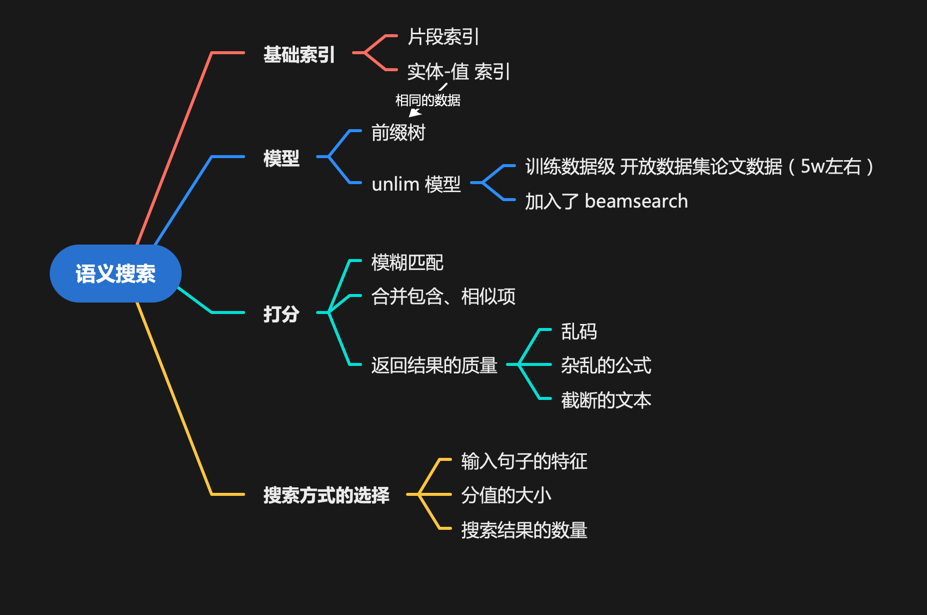
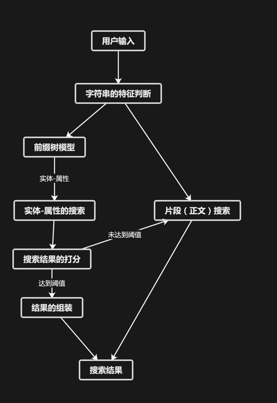

# 语义搜索

## 部署步骤
1. 拉取镜像
2. 启动docker容器
   ```
   docker run --gpus all --shm-size 4g --name semantic-search --net host -it -v [共享目录]:/data ai_write_outline_tree:3090_base bash
   ```
3. 进入docker内的/data目录,拉取本项目代码
   ```
   cd /data
   git clone https://gitee.com/whLaibo/semantic-search.git
   ```
4. 进入本项目，执行命令：
    ```
    bash sbin/start_nginx.sh # 启动nginx
    bash sbin/start_search.sh # 启动前缀树与聚合搜索
    ```
   
## 其他配置
nginx配置文件：semantic-search/config/ngconf/nginx.conf
gunicorn配置文件(路径)：semantic-search/sbin/start_search.sh
gpu选择、模型数据路径： semant-search/config/project_config.py


## 项目的主要逻辑
### 主要组件


### 主要流程
